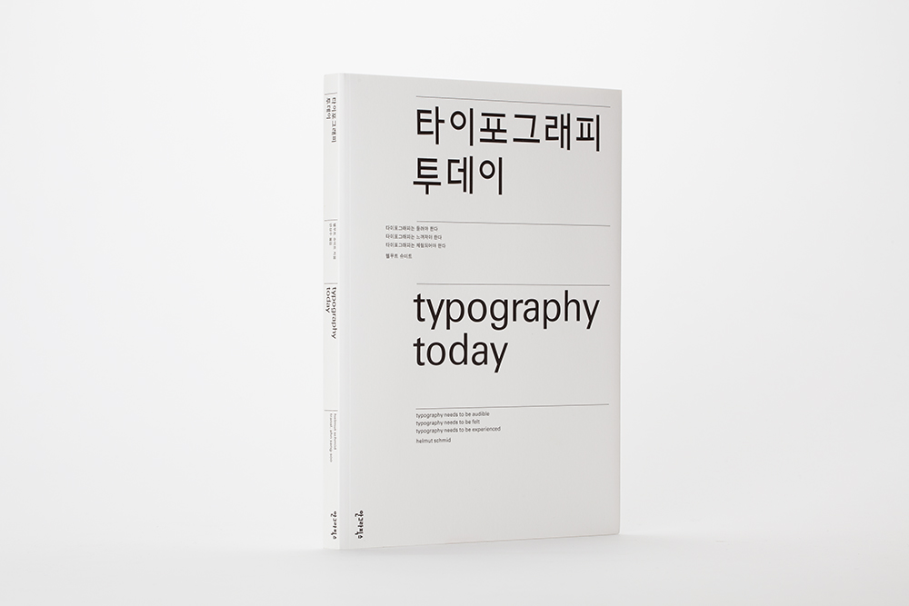
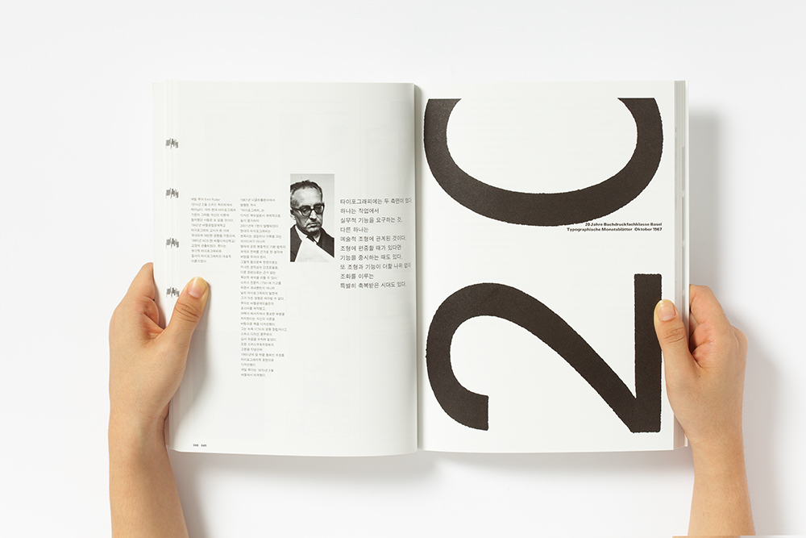

###### 이롭게 에이전시 교육

# DAY02

## 웹 타이포그래피

둘째날 우리 수업에서 진행할 내용은 **웹 환경에 적합한 타이포그래피 방법론**에 대해 알아보고, **실습**합니다.

* 본문(Body Text) 디자인(설계)
* 본문을 기반으로 하는 제목(Headings) 디자인
* 하이퍼링크(Hyperlinks) 디자인
* 수평/수직 리듬(Rhythm)

-

> '디자이너들의 디자인은 왠지 모르겠지만 클라이언트의 커미션에 따라 틀이 잡힌다. 나는 현재 디자인 조류에 대해 전혀 특별한 관심이 없지만, 디자인계에서 무슨 일이 일어나고 있는지는 알고 있다. 내 경우에 디자인은 콘텐츠에서 나온다. 즉, 디자인이 콘텐츠 속에 이미 들어 있기 때문에 디자이너는 그것을 찾아내기만 하면 된다.' - 에밀 루더

-

#### 좋은 본문 디자인

행폭(10개 단어 내외)과 함께 올바른 행간을 설정하는 것은 매우 중요합니다. 적당한 행간은 가독성을 크게 증진시키기 때문입니다. 행간은 글자의 개별 행들 사이 수직 공간을 말하며 기본적으로 대부분 브라우저는 행간을 120% 정도로 설정하는데... 이 기본 설정은 가독성이 다소 떨어집니다.

경험상 본문 크기의 150% 정도가 가장 보편적인 행간 설정입니다. 평균 행간에 대한 타이포그래피 디자인 패턴에 대한 연구 결과를 사펴보면 보편적으로 사용하고 있는 평균 행간은 글꼴 크기의 약 148% 가량. 경험에 의한 관습적 사용이 통상적으로도 적용되고 있습니다. 단, 행폭이 길어지면 상대적으로 행간도 넓혀줘야 합니다.

---

#### 실습 문구 1

###### 타이포그래피는 시각 해석에 의한 언어 전달이다.

읽기만 하는 타이포그래피란 있을 수 없다. 인쇄된 메시지는 모두 시각적이다. 오늘날 시각적 해석은 전에 없이 중요해졌다. 메시지는 단지 받는 사람에게 전달만 되는 것이 아니라 읽혀야 하기 때문이다. 오늘날 우리의 시각은 오염되었다. 조용하고 아름다운 메시지는 눈에 띄지 않고 읽히지도 않는다. 그래서 메시지는 해석이 필요하다. 글자를 치장하는 해석이 아니라 내용을 평가하는 해석이다. 즉, 본질적인 것에서 부차적인 것 또는 사소한 것으로 분해되는 사고에서 메시지 그 자체를 발견하는 해석이다. 광고에서뿐만 아니라 문학에서도, 이상적으로는 저자와 디자이너 사이의 밀접한 협력에서도 마찬가지로 해석이 필요하다.

> '화자의 소리가 그의 사고에 이끌려 나오듯이 타이포그래피 조소는 그 시각적 효과를 통해 형태가 된다.'(엘 리시츠키)

외침과 속삭임, 급함과 느슨함, 이 모두가 음성 커뮤니케이션의 표현법이다. 읽을거리 역시 외치고 속삭이고, 달리거나 어슬렁거리며, 미적 체험으로서 조용히 정답게 나타나야 한다. 신문은 책과는 다른 식으로 읽힐 것이다. 광고와 포스터도 다르다. 시각 프레젠테이션의 요건은 이미 그 내용에서 구현된다. 메시지에 중점을 두는 것이 기능적 타이포그래피의 포기를 의미하지는 않는다. 에밀 루더의 질서의 타이포그래피, 세부의 타이포그래피는 시간을 초월한다. 왜냐하면 미는 정보이기 때문이다.

하나의 질서를 새로운 질서로 대체하지는 못하지만 형식주의와 표절로 굳어진 질서에 새로운 생명을 불어넣을 수는 있다. 기능적 타이포그래피, 메시지를 전달하는 타이포그래피와는 별도로 타이포그래피는 자체의 미적 생명이 있다.

우리는 낱말을 읽고 문장을 읽는다. 그러나 글자가 의미를 이루어 배열되는 한 활자체의 형태적 가치는 알아차리지 못한다. 외국어를 읽거나 생소한 활자체를 보면 곧 형태부터 읽는다. 돌연 원과 직선, 안과 밖의 형태를 읽는다.

우리는 읽는 것이 아니라 본다. 아드리안 프루티거는 일체의 금기를 떠나서 인도어 활자체 데바나가리 뉴 스타일을 디자인했다. 마치 모던 타이포그래피의 개척자들이 전통에 얽매이지 않고 타이포그래피의 고착된 형식을 초월한 것처럼. 헬무트 역시 그가 읽을 수 없는 글자로 작업한다. 그에게 일본어 텍스트는 읽는 메시지가 아니라 보는 메시지이다. 그래서 글자의 형태가 강하게 의식된다. 그가 디자인한 일본의 낱내 글자, 가타카나는 '본다'는 장점에서 비롯한다. 형태의 판단 기준은 보편적이다. 일본어 텍스트는 원래 보는 것이다. 뜻글자는 시각적으로 읽을 수 있는 메시지를 내포한다. 이에 비해 소리글자는 단지 형태의 존재이다...

[타이포그래픽 투데이, 안그라픽스](http://agbook.co.kr/book/1270/)

---

#### 실습 문구 2

행폭(10개 단어 내외)과 함께 올바른 행간을 설정하는 것은 매우 중요합니다. 적당한 행간은 가독성을 크게 증진시키기 때문입니다. 행간은 글자의 개별 행들 사이 수직 공간을 말하며 기본적으로 대부분 브라우저는 행간을 120% 정도로 설정하는데... 이 기본 설정은 가독성이 다소 떨어집니다.

경험상 본문 크기의 150% 정도가 가장 보편적인 행간 설정입니다. 평균 행간에 대한 타이포그래피 디자인 패턴에 대한 연구 결과를 사펴보면 보편적으로 사용하고 있는 평균 행간은 글꼴 크기의 약 148% 가량. 경험에 의한 관습적 사용이 통상적으로도 적용되고 있습니다.

단, 행폭이 길어지면 상대적으로 행간도 넓혀줘야 합니다.

---

#### 참고글

* [Baseline](http://baselinecss.com/)
* [Setting Type on the Web to a Baseline Grid](http://alistapart.com/article/settingtypeontheweb)
* [Relative font sizes and inheritance](http://maxdesign.com.au/articles/relative/)
* [Scale & Rhythm](http://lamb.cc/typograph/)
* [Compose to a Vertical Rhythm](http://24ways.org/2006/compose-to-a-vertical-rhythm)
* [Incremental Leading](http://www.markboulton.co.uk/journal/incremental-leading)
* [4 Simple Steps to Vertical Rhythm](http://typecast.com/blog/4-simple-steps-to-vertical-rhythm)
* [CSS Baseline: The Good, The Bad And The Ugly](http://www.smashingmagazine.com/2012/12/17/css-baseline-the-good-the-bad-and-the-ugly/)
* [gridlover.net](http://www.gridlover.net/app/)
* [modularscale.com](http://www.modularscale.com/?1&em&1.5&web&text)