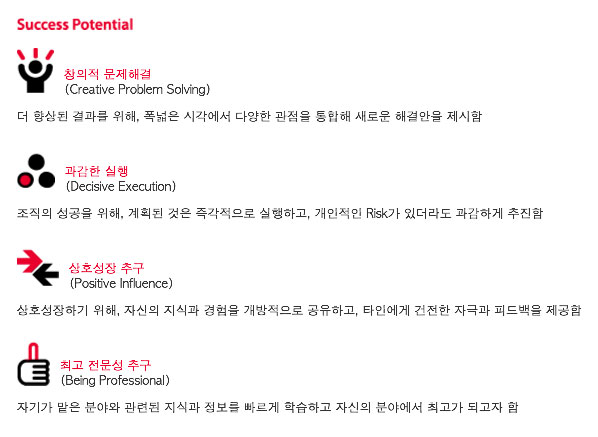

###### 이롭게 에이전시 교육

# DAY06

### 1. 정의 목록

정의 목록을 공부한 다음, 아래 그래픽을 웹 데이터로 구현.

- 창의적 문제해결(Creative Problem Solving) 
  더 향상된 결과를 위해, 폭넓은 시각에서 다양한 관점을 통합해 새로운 해결안을 제시함

- 과감한 실행(Decisive Execution) 
  조직의 성공을 위해, 계획된 것은 즉각적으로 실행하고, 개인적인 Risk가 있더라도 과감하게 추진함

- 상호성장 추구(Positive Influence) 
  상호성장하기 위해, 자신의 지식과 경험을 개방적으로 공유하고, 타인에게 건전한 자극과 피드백을 제공함

- 최고 전문성 추구(Being Professional) 
  자기가 맡은 분야와 관련된 지식과 정보를 빠르게 학습하고 자신의 분야에서 최고가 되고자 함

-

### 2. PSD to HTML/CSS

디자인 그래픽 리소스를 웹 데이터로 구현.

디자인 리소스: [Article.psd](../Resources/PSD/Article.psd)

